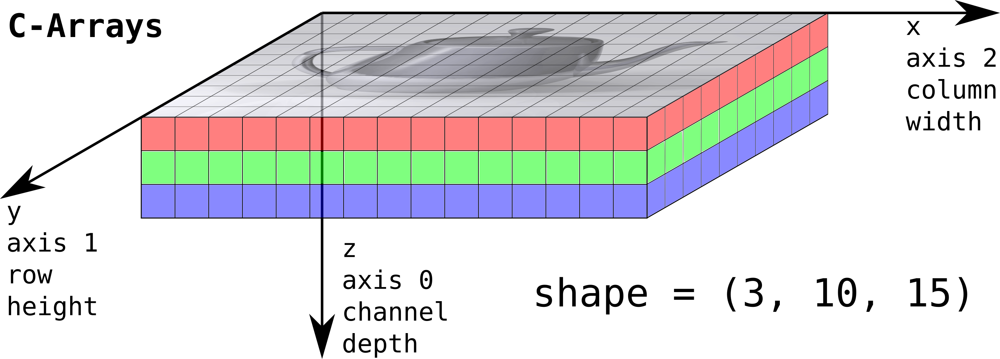

# Convolution using Python 3 and CUDA for GPU-Acceleration

Minimal example of a CUDA kernel that applies a convolution to a 2D matrix using tex2D. The kernel is written in pure CUDA-C but launched from Python 3 by using the PyCuda API.

`kernel.cu` contains the CUDA kernel which is read by the `main.py` file.

# Setup

## Docker (Linux only)

A possible setup with docker is described in the `docker` directory. (Note: Using Docker for PyCuda is only supported for Linux because you need `NVIDIA-Docker` which is not available for Windows due to compatibility issues with the Windows hypervisor.)
`get_docker.sh` installs docker and it's dependencies for usage with GPU.
After building a docker image with 

```bash
docker build -t stascheit/gpgpu .
```
the `launch_tst.sh` can be executed to run unittests (in `tst_docker_setup`) to the built docker image in order to validate the installation.

## Manual installation (Ubuntu Core Linux)

1. Download and install Anaconda

2. Verify NVIDIA Driver installation

   ```bash
   nvidia-smi
   ```

3. Install CUDA and PyCuda

   ```bash
   # install NVIDIA CUDA-Toolkit
   sudo apt install nvidia-cuda-toolkit
   # verify installation
   nvcc -V
   
   # install PyCuda
   pip install pycuda
   ```

# Index terminology in CUDA-C

